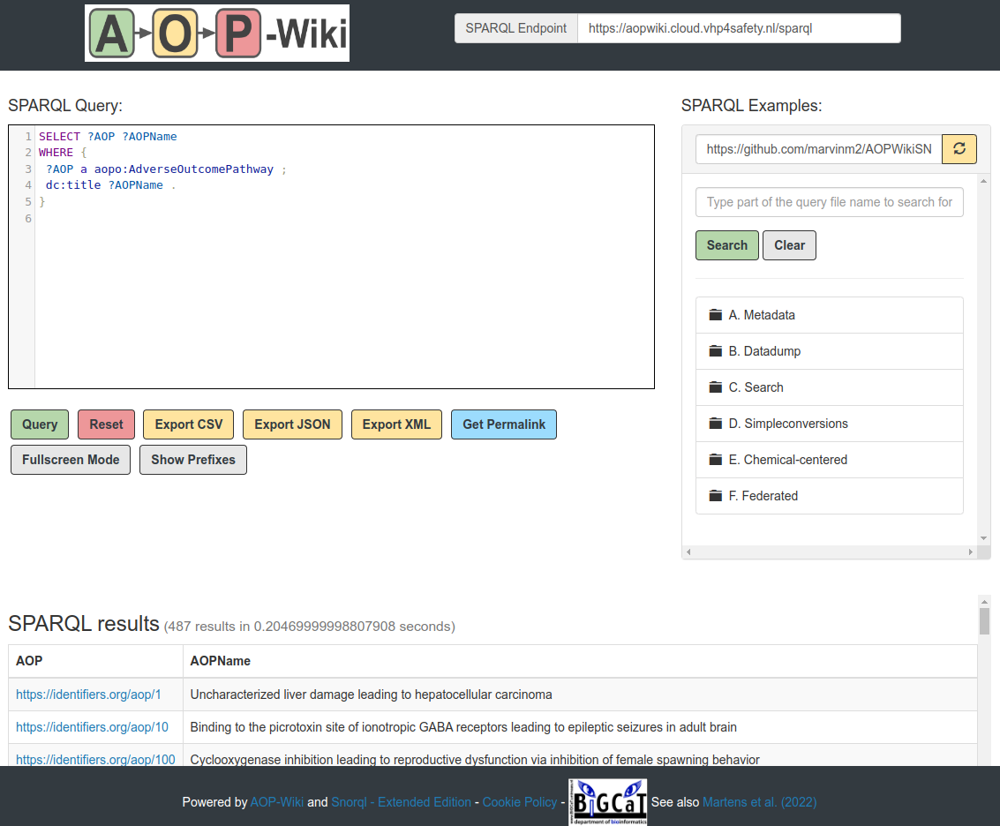
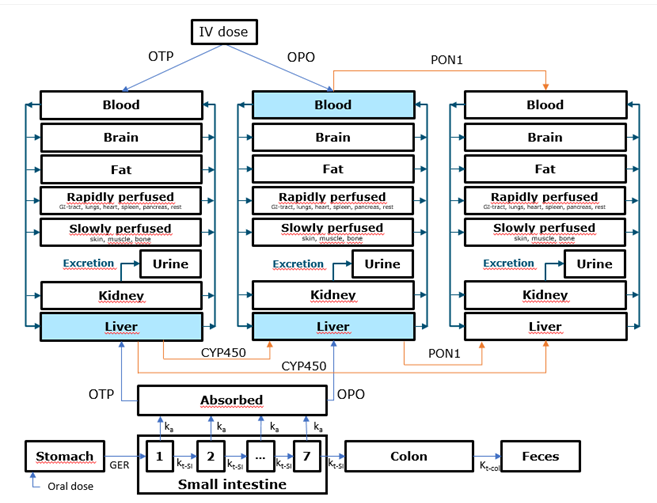
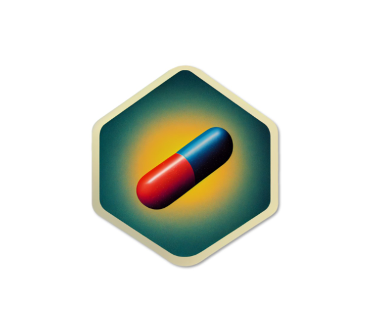

# VHP4Safety Cloud Services

<!-- THIS FILE IS AUTOGENERATED. DO NOT EDIT. -->

VHP4Safety needs a cloud with a high diversity of services to support their case studies.
The services will run on (interal) but also outside (external) the VHP4Safety cloud,
on a case by case basis.

This webpage gives an overview of the VHP4Safety Cloud Services on the Production and
Development platforms. The second is where we develop and test cloud services, while the
first runs a stable version of the service.

Below you find an overview of services available in the context of the VHP4Safety Platform.
[Additional services have been suggested](https://github.com/VHP4Safety/cloud/labels/service)
and users can [request additional services](https://github.com/VHP4Safety/cloud/issues/new/choose).

## Cloud Catalog

The VHP4Safety Cloud catalog of potential, internal, and external services is
available [here](catalog.md).

### Service Contributions

You are welcome to contribute to this catalog by requesting or adding new services. Please see [the manual](service/misc/creating_service_help_page.md) to see the options for contribute to the catalog. Please contact us through the issues using the [issue pages](https://github.com/VHP4Safety/cloud/issues) of this repository. 

## VHP4Safety Platform

The current development platform runs several services.

### <svg xmlns="http://www.w3.org/2000/svg" height="0.75em" viewBox="0 0 640 512"><!--! Font Awesome Free 6.4.2 by @fontawesome - https://fontawesome.com License - https://fontawesome.com/license (Commercial License) Copyright 2023 Fonticons, Inc. --><path d="M0 336c0 79.5 64.5 144 144 144H512c70.7 0 128-57.3 128-128c0-61.9-44-113.6-102.4-125.4c4.1-10.7 6.4-22.4 6.4-34.6c0-53-43-96-96-96c-19.7 0-38.1 6-53.3 16.2C367 64.2 315.3 32 256 32C167.6 32 96 103.6 96 192c0 2.7 .1 5.4 .2 8.1C40.2 219.8 0 273.2 0 336z"/></svg> AOP-Wiki Snorql UI

A graphical interface to make queries to the AOP-Wiki SPARQL endpoint. [[more info](service/aopwiki.md)]

### <svg xmlns="http://www.w3.org/2000/svg" height="0.75em" viewBox="0 0 640 512"><!--! Font Awesome Free 6.4.2 by @fontawesome - https://fontawesome.com License - https://fontawesome.com/license (Commercial License) Copyright 2023 Fonticons, Inc. --><path d="M0 336c0 79.5 64.5 144 144 144H512c70.7 0 128-57.3 128-128c0-61.9-44-113.6-102.4-125.4c4.1-10.7 6.4-22.4 6.4-34.6c0-53-43-96-96-96c-19.7 0-38.1 6-53.3 16.2C367 64.2 315.3 32 256 32C167.6 32 96 103.6 96 192c0 2.7 .1 5.4 .2 8.1C40.2 219.8 0 273.2 0 336z"/></svg> BridgeDb

A framework to map identifiers between various biological databases and related sources. [[more info](service/bridgedb.md)]

### <svg xmlns="http://www.w3.org/2000/svg" height="0.75em" viewBox="0 0 640 512"><!--! Font Awesome Free 6.4.2 by @fontawesome - https://fontawesome.com License - https://fontawesome.com/license (Commercial License) Copyright 2023 Fonticons, Inc. --><path d="M0 336c0 79.5 64.5 144 144 144H512c70.7 0 128-57.3 128-128c0-61.9-44-113.6-102.4-125.4c4.1-10.7 6.4-22.4 6.4-34.6c0-53-43-96-96-96c-19.7 0-38.1 6-53.3 16.2C367 64.2 315.3 32 256 32C167.6 32 96 103.6 96 192c0 2.7 .1 5.4 .2 8.1C40.2 219.8 0 273.2 0 336z"/></svg> CDK Depict

A webservice to convert SMILES into 2D depictions in either SVG, PNG, and PNG formats. [[more info](service/cdkdepict.md)]

### <svg xmlns="http://www.w3.org/2000/svg" height="0.75em" viewBox="0 0 640 512"><!--! Font Awesome Free 6.4.2 by @fontawesome - https://fontawesome.com License - https://fontawesome.com/license (Commercial License) Copyright 2023 Fonticons, Inc. --><path d="M0 336c0 79.5 64.5 144 144 144H512c70.7 0 128-57.3 128-128c0-61.9-44-113.6-102.4-125.4c4.1-10.7 6.4-22.4 6.4-34.6c0-53-43-96-96-96c-19.7 0-38.1 6-53.3 16.2C367 64.2 315.3 32 256 32C167.6 32 96 103.6 96 192c0 2.7 .1 5.4 .2 8.1C40.2 219.8 0 273.2 0 336z"/></svg> cpLogD

A model to predict water–octanol distribution coefficient (logD) for chemical compounds which is a proxy for the lipophilicity which is a major determinant of drug properties and overall suitability of drug candidates. [[more info](service/cplogd.md)]

### <svg xmlns="http://www.w3.org/2000/svg" height="0.75em" viewBox="0 0 640 512"><!--! Font Awesome Free 6.4.2 by @fontawesome - https://fontawesome.com License - https://fontawesome.com/license (Commercial License) Copyright 2023 Fonticons, Inc. --><path d="M0 336c0 79.5 64.5 144 144 144H512c70.7 0 128-57.3 128-128c0-61.9-44-113.6-102.4-125.4c4.1-10.7 6.4-22.4 6.4-34.6c0-53-43-96-96-96c-19.7 0-38.1 6-53.3 16.2C367 64.2 315.3 32 256 32C167.6 32 96 103.6 96 192c0 2.7 .1 5.4 .2 8.1C40.2 219.8 0 273.2 0 336z"/></svg> VHP4Safety Wikibase User Interface

A Synia-based graphical user interface to the content of the VHP4Safety Wikibase using SPARQL queries. [[more info](service/wikibase.md)]

### <svg xmlns="http://www.w3.org/2000/svg" height="0.75em" viewBox="0 0 640 512"><!--! Font Awesome Free 6.4.2 by @fontawesome - https://fontawesome.com License - https://fontawesome.com/license (Commercial License) Copyright 2023 Fonticons, Inc. --><path d="M0 336c0 79.5 64.5 144 144 144H512c70.7 0 128-57.3 128-128c0-61.9-44-113.6-102.4-125.4c4.1-10.7 6.4-22.4 6.4-34.6c0-53-43-96-96-96c-19.7 0-38.1 6-53.3 16.2C367 64.2 315.3 32 256 32C167.6 32 96 103.6 96 192c0 2.7 .1 5.4 .2 8.1C40.2 219.8 0 273.2 0 336z"/></svg> OP PBK Model

To be added [[more info](service/oppbk_model.md)]

### <svg xmlns="http://www.w3.org/2000/svg" height="0.75em" viewBox="0 0 640 512"><!--! Font Awesome Free 6.4.2 by @fontawesome - https://fontawesome.com License - https://fontawesome.com/license (Commercial License) Copyright 2023 Fonticons, Inc. --><path d="M0 336c0 79.5 64.5 144 144 144H512c70.7 0 128-57.3 128-128c0-61.9-44-113.6-102.4-125.4c4.1-10.7 6.4-22.4 6.4-34.6c0-53-43-96-96-96c-19.7 0-38.1 6-53.3 16.2C367 64.2 315.3 32 256 32C167.6 32 96 103.6 96 192c0 2.7 .1 5.4 .2 8.1C40.2 219.8 0 273.2 0 336z"/></svg> QSPRpred

This tool allows users to predict the activity of their chemicals of interest for various endpoints. This prediction is done by target-specific, pretrained QSAR models. These models are specific for endpoints related to molecular initiation events from the VHP4Safety case studies. [[more info](service/qsprpred.md)]

### <svg xmlns="http://www.w3.org/2000/svg" height="0.75em" viewBox="0 0 640 512"><!--! Font Awesome Free 6.4.2 by @fontawesome - https://fontawesome.com License - https://fontawesome.com/license (Commercial License) Copyright 2023 Fonticons, Inc. --><path d="M0 336c0 79.5 64.5 144 144 144H512c70.7 0 128-57.3 128-128c0-61.9-44-113.6-102.4-125.4c4.1-10.7 6.4-22.4 6.4-34.6c0-53-43-96-96-96c-19.7 0-38.1 6-53.3 16.2C367 64.2 315.3 32 256 32C167.6 32 96 103.6 96 192c0 2.7 .1 5.4 .2 8.1C40.2 219.8 0 273.2 0 336z"/></svg> SOM Prediction

A webservice to conduct protein-structure and reactivity based (P450) site-of-metabolism prediction. [[more info](service/sombie.md)]

### <svg xmlns="http://www.w3.org/2000/svg" height="0.75em" viewBox="0 0 640 512"><!--! Font Awesome Free 6.4.2 by @fontawesome - https://fontawesome.com License - https://fontawesome.com/license (Commercial License) Copyright 2023 Fonticons, Inc. --><path d="M0 336c0 79.5 64.5 144 144 144H512c70.7 0 128-57.3 128-128c0-61.9-44-113.6-102.4-125.4c4.1-10.7 6.4-22.4 6.4-34.6c0-53-43-96-96-96c-19.7 0-38.1 6-53.3 16.2C367 64.2 315.3 32 256 32C167.6 32 96 103.6 96 192c0 2.7 .1 5.4 .2 8.1C40.2 219.8 0 273.2 0 336z"/></svg> xploreaop

A web application to visualize Adverse Outcome Pathway (AOP) networks and interactively explore the AOPs for two liver outcomes, Cholestasis and Steatosis. [[more info](service/xploreaop.md)]

## External Services

### <svg xmlns="http://www.w3.org/2000/svg" height="0.75em" viewBox="0 0 512 512"><!--! Font Awesome Free 6.4.2 by @fontawesome - https://fontawesome.com License - https://fontawesome.com/license (Commercial License) Copyright 2023 Fonticons, Inc. --><path d="M352 0c-12.9 0-24.6 7.8-29.6 19.8s-2.2 25.7 6.9 34.9L370.7 96 201.4 265.4c-12.5 12.5-12.5 32.8 0 45.3s32.8 12.5 45.3 0L416 141.3l41.4 41.4c9.2 9.2 22.9 11.9 34.9 6.9s19.8-16.6 19.8-29.6V32c0-17.7-14.3-32-32-32H352zM80 32C35.8 32 0 67.8 0 112V432c0 44.2 35.8 80 80 80H400c44.2 0 80-35.8 80-80V320c0-17.7-14.3-32-32-32s-32 14.3-32 32V432c0 8.8-7.2 16-16 16H80c-8.8 0-16-7.2-16-16V112c0-8.8 7.2-16 16-16H192c17.7 0 32-14.3 32-32s-14.3-32-32-32H80z"/></svg> PopGen

An online service to generate a virtual human population. Note that the service has been retired. [[more info](service/popgen.md)]

### <svg xmlns="http://www.w3.org/2000/svg" height="0.75em" viewBox="0 0 512 512"><!--! Font Awesome Free 6.4.2 by @fontawesome - https://fontawesome.com License - https://fontawesome.com/license (Commercial License) Copyright 2023 Fonticons, Inc. --><path d="M352 0c-12.9 0-24.6 7.8-29.6 19.8s-2.2 25.7 6.9 34.9L370.7 96 201.4 265.4c-12.5 12.5-12.5 32.8 0 45.3s32.8 12.5 45.3 0L416 141.3l41.4 41.4c9.2 9.2 22.9 11.9 34.9 6.9s19.8-16.6 19.8-29.6V32c0-17.7-14.3-32-32-32H352zM80 32C35.8 32 0 67.8 0 112V432c0 44.2 35.8 80 80 80H400c44.2 0 80-35.8 80-80V320c0-17.7-14.3-32-32-32s-32 14.3-32 32V432c0 8.8-7.2 16-16 16H80c-8.8 0-16-7.2-16-16V112c0-8.8 7.2-16 16-16H192c17.7 0 32-14.3 32-32s-14.3-32-32-32H80z"/></svg> PopGen

An online service to generate a virtual human population. [[more info](service/popgen.md)]

### <svg xmlns="http://www.w3.org/2000/svg" height="0.75em" viewBox="0 0 512 512"><!--! Font Awesome Free 6.4.2 by @fontawesome - https://fontawesome.com License - https://fontawesome.com/license (Commercial License) Copyright 2023 Fonticons, Inc. --><path d="M352 0c-12.9 0-24.6 7.8-29.6 19.8s-2.2 25.7 6.9 34.9L370.7 96 201.4 265.4c-12.5 12.5-12.5 32.8 0 45.3s32.8 12.5 45.3 0L416 141.3l41.4 41.4c9.2 9.2 22.9 11.9 34.9 6.9s19.8-16.6 19.8-29.6V32c0-17.7-14.3-32-32-32H352zM80 32C35.8 32 0 67.8 0 112V432c0 44.2 35.8 80 80 80H400c44.2 0 80-35.8 80-80V320c0-17.7-14.3-32-32-32s-32 14.3-32 32V432c0 8.8-7.2 16-16 16H80c-8.8 0-16-7.2-16-16V112c0-8.8 7.2-16 16-16H192c17.7 0 32-14.3 32-32s-14.3-32-32-32H80z"/></svg> SysRev

An online service to conduct literature review, data extraction and systematic review. [[more info](service/sysrev.md)]

### <svg xmlns="http://www.w3.org/2000/svg" height="0.75em" viewBox="0 0 512 512"><!--! Font Awesome Free 6.4.2 by @fontawesome - https://fontawesome.com License - https://fontawesome.com/license (Commercial License) Copyright 2023 Fonticons, Inc. --><path d="M352 0c-12.9 0-24.6 7.8-29.6 19.8s-2.2 25.7 6.9 34.9L370.7 96 201.4 265.4c-12.5 12.5-12.5 32.8 0 45.3s32.8 12.5 45.3 0L416 141.3l41.4 41.4c9.2 9.2 22.9 11.9 34.9 6.9s19.8-16.6 19.8-29.6V32c0-17.7-14.3-32-32-32H352zM80 32C35.8 32 0 67.8 0 112V432c0 44.2 35.8 80 80 80H400c44.2 0 80-35.8 80-80V320c0-17.7-14.3-32-32-32s-32 14.3-32 32V432c0 8.8-7.2 16-16 16H80c-8.8 0-16-7.2-16-16V112c0-8.8 7.2-16 16-16H192c17.7 0 32-14.3 32-32s-14.3-32-32-32H80z"/></svg> TXG-MAPr

An online application to implement weighted gene co-expression network analysis (WGCNA) derived from the Primary Human Hepatocytes (PHH) TG-GATEs data sets. [[more info](service/txg_mapr.md)]

### <svg xmlns="http://www.w3.org/2000/svg" height="0.75em" viewBox="0 0 512 512"><!--! Font Awesome Free 6.4.2 by @fontawesome - https://fontawesome.com License - https://fontawesome.com/license (Commercial License) Copyright 2023 Fonticons, Inc. --><path d="M352 0c-12.9 0-24.6 7.8-29.6 19.8s-2.2 25.7 6.9 34.9L370.7 96 201.4 265.4c-12.5 12.5-12.5 32.8 0 45.3s32.8 12.5 45.3 0L416 141.3l41.4 41.4c9.2 9.2 22.9 11.9 34.9 6.9s19.8-16.6 19.8-29.6V32c0-17.7-14.3-32-32-32H352zM80 32C35.8 32 0 67.8 0 112V432c0 44.2 35.8 80 80 80H400c44.2 0 80-35.8 80-80V320c0-17.7-14.3-32-32-32s-32 14.3-32 32V432c0 8.8-7.2 16-16 16H80c-8.8 0-16-7.2-16-16V112c0-8.8 7.2-16 16-16H192c17.7 0 32-14.3 32-32s-14.3-32-32-32H80z"/></svg> VHP4Safety Wikibase

A Wikibase instance to store and present information about toxic, safe and potentially toxic compounds related to the VHP4Safety project. [[more info](service/wikibase.md)]

### <svg xmlns="http://www.w3.org/2000/svg" height="0.75em" viewBox="0 0 512 512"><!--! Font Awesome Free 6.4.2 by @fontawesome - https://fontawesome.com License - https://fontawesome.com/license (Commercial License) Copyright 2023 Fonticons, Inc. --><path d="M352 0c-12.9 0-24.6 7.8-29.6 19.8s-2.2 25.7 6.9 34.9L370.7 96 201.4 265.4c-12.5 12.5-12.5 32.8 0 45.3s32.8 12.5 45.3 0L416 141.3l41.4 41.4c9.2 9.2 22.9 11.9 34.9 6.9s19.8-16.6 19.8-29.6V32c0-17.7-14.3-32-32-32H352zM80 32C35.8 32 0 67.8 0 112V432c0 44.2 35.8 80 80 80H400c44.2 0 80-35.8 80-80V320c0-17.7-14.3-32-32-32s-32 14.3-32 32V432c0 8.8-7.2 16-16 16H80c-8.8 0-16-7.2-16-16V112c0-8.8 7.2-16 16-16H192c17.7 0 32-14.3 32-32s-14.3-32-32-32H80z"/></svg> WikiPathways - AOP Portal

An Adverse Outcome Pathway (AOP) portal for WikiPathways to highlight the molecular basis of AOPs or events in AOPs. [[more info](service/wikipathways_aop.md)]

## Persona-Specific Catalogs

You can reach the list of services that are associated with specific persona's below. 

[Persona 1](persona1.md)
[Persona 2](persona2.md)
[Persona 3](persona3.md)

### Funding

VHP4Safety – the Virtual Human Platform for safety assessment project
[NWA 1292.19.272](https://www.nwo.nl/projecten/nwa129219272) is part of the NWA
research program ‘Research along Routes by Consortia (ORC)’, which is funded by the Netherlands Organization
for Scientific Research (NWO). The project started on June 1, 2021 with a budget of over 10 million Euros
and will last for the duration of 5 years. 

